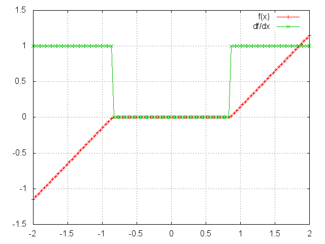
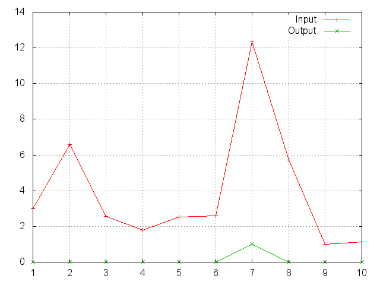
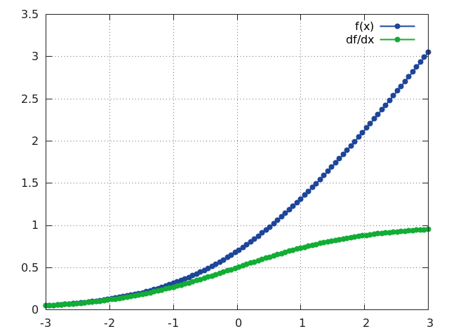
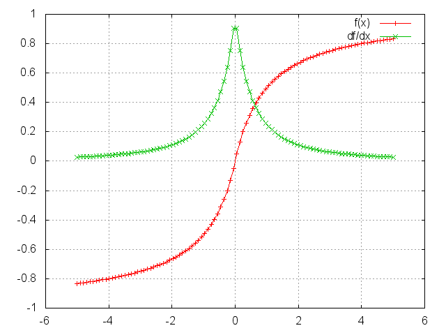
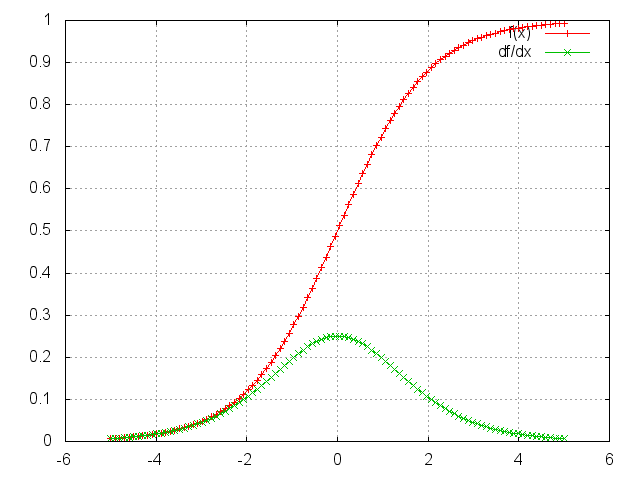
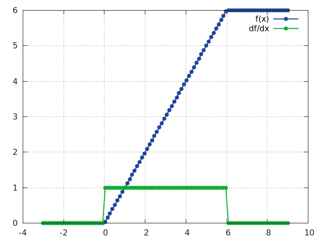
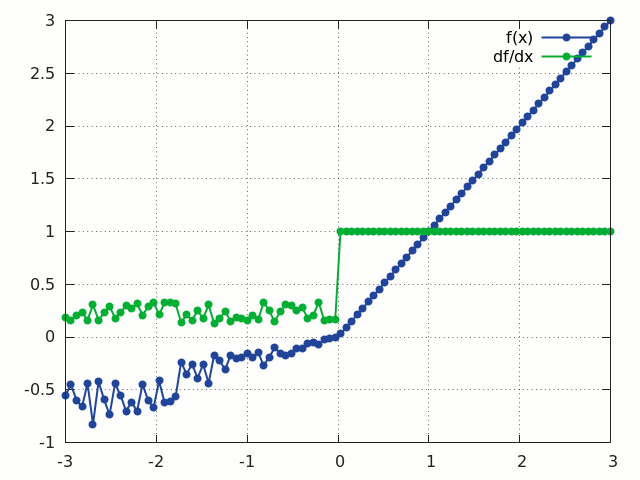
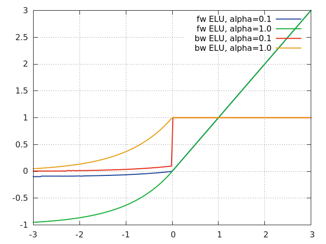

<a name="nn.transfer.dok"></a>
# Transfer Function Layers #

Transfer functions are normally used to introduce a non-linearity after a parameterized layer like [`Linear`](t7nnsimple.md#nn.Linear) and [`SpatialConvolution`](t7nnconvolution.md#nn.SpatialConvolution).
Non-linearities allows for dividing the problem space into more complex regions than what a simple logistic regressor would permit.


<a name="nn.HardTanh"></a>
## HardTanh ##

```lua
f = nn.HardTanh([min_value, max_value[, inplace]])
```

Applies the `HardTanh` function element-wise to the input `Tensor`, thus outputting a `Tensor` of the same dimension.

`HardTanh` is defined as:

```lua
       ⎧  1, if x >  1
f(x) = ⎨ -1, if x < -1
       ⎩  x, otherwise
```

The range of the linear region `[-1 1]` can be adjusted by specifying arguments in declaration, for example  `nn.HardTanh(min_value, max_value)`.
Otherwise, `[min_value max_value]` is set to `[-1 1]` by default.
In-place operation defined by third argument boolean.

```lua
ii = torch.linspace(-2, 2)
m = nn.HardTanh()
oo = m:forward(ii)
go = torch.ones(100)
gi = m:backward(ii, go)
gnuplot.plot({'f(x)', ii, oo, '+-'}, {'df/dx', ii, gi, '+-'})
gnuplot.grid(true)
```


<a name="nn.HardShrink"></a>
## HardShrink ##

```lua
f = nn.HardShrink([lambda])
```

Applies the hard shrinkage function element-wise to the input `Tensor`.
`lambda` is set to `0.5` by default.

`HardShrinkage` operator is defined as:

```lua
       ⎧ x, if x >  lambda
f(x) = ⎨ x, if x < -lambda
       ⎩ 0, otherwise
```

```lua
ii = torch.linspace(-2, 2)
m = nn.HardShrink(0.85)
oo = m:forward(ii)
go = torch.ones(100)
gi = m:backward(ii, go)
gnuplot.plot({'f(x)', ii, oo, '+-'}, {'df/dx', ii, gi, '+-'})
gnuplot.grid(true)
```


<a name="nn.SoftShrink"></a>
## SoftShrink ##

```lua
f = nn.SoftShrink([lambda])
```

Applies the soft shrinkage function element-wise to the input `Tensor`.
`lambda` is set to `0.5` by default.

`SoftShrinkage` operator is defined as:

```lua
       ⎧ x - lambda, if x >  lambda
f(x) = ⎨ x + lambda, if x < -lambda
       ⎩ 0, otherwise
```

```lua
ii = torch.linspace(-2, 2)
m = nn.SoftShrink(0.85)
oo = m:forward(ii)
go = torch.ones(100)
gi = m:backward(ii, go)
gnuplot.plot({'f(x)', ii, oo, '+-'}, {'df/dx', ii, gi, '+-'})
gnuplot.grid(true)
```




<a name="nn.SoftMax"></a>
## SoftMax ##

```lua
f = nn.SoftMax()
```

Applies the `SoftMax` function to an n-dimensional input `Tensor`, rescaling them so that the elements of the n-dimensional output Tensor
lie in the range `(0, 1)` and sum to `1`.

`Softmax` is defined as:

```lua
f_i(x) = exp(x_i - shift) / sum_j exp(x_j - shift)
```

where `shift = max_i(x_i)`.


```lua
ii = torch.exp(torch.abs(torch.randn(10)))
m = nn.SoftMax()
oo = m:forward(ii)
gnuplot.plot({'Input', ii, '+-'}, {'Output', oo, '+-'})
gnuplot.grid(true)
```



Note that this module doesn't work directly with [`ClassNLLCriterion`](t7nncriterion.md#nn.ClassNLLCriterion), which expects the `nn.Log` to be computed between the `SoftMax` and itself.
Use [`LogSoftMax`](#nn.LogSoftMax) instead (it's faster).


<a name="nn.SoftMin"></a>
## SoftMin ##

```lua
f = nn.SoftMin()
```

Applies the `SoftMin` function to an n-dimensional input `Tensor`, rescaling them so that the elements of the n-dimensional output `Tensor` lie in the range `(0,1)` and sum to `1`.

`Softmin` is defined as:

```lua
f_i(x) = exp(-x_i - shift) / sum_j exp(-x_j - shift)
```

where `shift = max_i(-x_i)`.

```lua
ii = torch.exp(torch.abs(torch.randn(10)))
m = nn.SoftMin()
oo = m:forward(ii)
gnuplot.plot({'Input', ii, '+-'}, {'Output', oo, '+-'})
gnuplot.grid(true)
```


<a name="nn.SoftPlus"></a>
### SoftPlus ###

```lua
f = nn.SoftPlus()
```

Applies the `SoftPlus` function to an n-dimensioanl input `Tensor`.
`SoftPlus` is a smooth approximation to the [`ReLU`](#nn.ReLU) function and can be used to constrain the output of a machine to always be positive.
For numerical stability the implementation reverts to the linear function for inputs above a certain value (20 by default).

`SoftPlus` is defined as:

```lua
f_i(x) = 1/beta * log(1 + exp(beta * x_i))
```

```lua
ii = torch.linspace(-3, 3)
m = nn.SoftPlus()
oo = m:forward(ii)
go = torch.ones(100)
gi = m:backward(ii, go)
gnuplot.plot({'f(x)', ii, oo, '+-'}, {'df/dx', ii, gi, '+-'})
gnuplot.grid(true)
```




<a name="nn.SoftSign"></a>
## SoftSign ##

```lua
f = nn.SoftSign()
```

Applies the `SoftSign` function to an n-dimensioanl input `Tensor`.

`SoftSign` is defined as:

```lua
f_i(x) = x_i / (1+|x_i|)
```

```lua
ii = torch.linspace(-5, 5)
m = nn.SoftSign()
oo = m:forward(ii)
go = torch.ones(100)
gi = m:backward(ii, go)
gnuplot.plot({'f (x)', ii, oo, '+-'}, {'df/dx', ii, gi, '+-'})
gnuplot.grid(true)
```




<a name="nn.LogSigmoid"></a>
## LogSigmoid ##

```lua
f = nn.LogSigmoid()
```

Applies the `LogSigmoid` function to an n-dimensional input `Tensor`.

`LogSigmoid` is defined as:

```lua
f_i(x) = log(1 / (1 + exp(-x_i)))
```

```lua
ii = torch.randn(10)
m = nn.LogSigmoid()
oo = m:forward(ii)
go = torch.ones(10)
gi = m:backward(ii, go)
gnuplot.plot({'Input', ii, '+-'}, {'Output', oo, '+-'}, {'gradInput', gi, '+-'})
gnuplot.grid(true)
```


<a name="nn.LogSoftMax"></a>
## LogSoftMax ##

```lua
f = nn.LogSoftMax()
```

Applies the `LogSoftMax` function to an n-dimensional input `Tensor`.

`LogSoftmax` is defined as:

```lua
f_i(x) = log(1 / a exp(x_i))
```

where  `a = sum_j[exp(x_j)]`.

```lua
ii = torch.randn(10)
m = nn.LogSoftMax()
oo = m:forward(ii)
go = torch.ones(10)
gi = m:backward(ii, go)
gnuplot.plot({'Input', ii, '+-'}, {'Output', oo, '+-'}, {'gradInput', gi, '+-'})
gnuplot.grid(true)
```


<a name="nn.Sigmoid"></a>
## Sigmoid ##

```lua
f = nn.Sigmoid()
```

Applies the `Sigmoid` function element-wise to the input `Tensor`, thus outputting a Tensor of the same dimension.

`Sigmoid` is defined as:

```lua
f(x) = 1 / (1 + exp(-x))
```

```lua
ii = torch.linspace(-5, 5)
m = nn.Sigmoid()
oo = m:forward(ii)
go = torch.ones(100)
gi = m:backward(ii, go)
gnuplot.plot({'f(x)', ii, oo, '+-'}, {'df/dx', ii, gi, '+-'})
gnuplot.grid(true)
```




<a name="nn.Tanh"></a>
## Tanh ##

```lua
f = nn.Tanh()
```

Applies the `Tanh` function element-wise to the input `Tensor`, thus outputting a `Tensor` of the same dimension.

`Tanh` is defined as:

```lua
f(x) = (exp(x) - exp(-x)) / (exp(x) + exp(-x))
```

```lua
ii = torch.linspace(-3, 3)
m = nn.Tanh()
oo = m:forward(ii)
go = torch.ones(100)
gi = m:backward(ii, go)
gnuplot.plot({'f(x)', ii, oo, '+-'}, {'df/dx', ii, gi, '+-'})
gnuplot.grid(true)
```


<a name="nn.ReLU"></a>
## ReLU ##

```lua
f = nn.ReLU([inplace])
```

Applies the rectified linear unit (`ReLU`) function element-wise to the input `Tensor`, thus outputting a `Tensor` of the same dimension.

`ReLU` is defined as:

```lua
f(x) = max(0, x)
```

Can optionally do its operation in-place without using extra state memory:

```lua
f = nn.ReLU(true) -- true = in-place, false = keeping separate state.
```

```lua
ii = torch.linspace(-3, 3)
m = nn.ReLU()
oo = m:forward(ii)
go = torch.ones(100)
gi = m:backward(ii, go)
gnuplot.plot({'f(x)', ii, oo, '+-'}, {'df/dx', ii, gi, '+-'})
gnuplot.grid(true)
```


<a name="nn.ReLU6"></a>
## ReLU6 ##

```lua
f = nn.ReLU6([inplace])
```

Same as `ReLU` except that the rectifying function `f(x)` saturates at `x = 6`.
This layer is useful for training networks that do not loose precision (due to FP saturation) when implemented as FP16.

`ReLU6` is defined as:

```lua
f(x) = min(max(0, x), 6)
```

Can optionally do its operation in-place without using extra state memory:

```lua
f = nn.ReLU6(true) -- true = in-place, false = keeping separate state.
```

```lua
ii = torch.linspace(-3, 9)
m = nn.ReLU6()
oo = m:forward(ii)
go = torch.ones(100)
gi = m:backward(ii, go)
gnuplot.plot({'f(x)', ii, oo, '+-'}, {'df/dx', ii, gi, '+-'})
gnuplot.grid(true)
```




<a name="nn.PReLU"></a>
## PReLU ##

```lua
f = nn.PReLU()
```

Applies parametric `ReLU`, which parameter varies the slope of the negative part:

`PReLU` is defined as:

```lua
f(x) = max(0, x) + a * min(0, x)
```

When called without a number on input as `nn.PReLU()` uses shared version, meaning has only one parameter.
Otherwise if called `nn.PReLU(nOutputPlane)` has `nOutputPlane` parameters, one for each input map.
The output dimension is always equal to input dimension.
Note that weight decay should not be used on it.
For reference see [Delving Deep into Rectifiers](http://arxiv.org/abs/1502.01852).


<a name="nn.RReLU"></a>
## RReLU ##

```lua
f = nn.RReLU([l, u[, inplace]])
```

Applies the randomized leaky rectified linear unit (`RReLU`) element-wise to the input `Tensor`, thus outputting a `Tensor` of the same dimension.
Informally the `RReLU` is also known as 'insanity' layer.

`RReLU` is defined as:

```lua
f(x) = max(0,x) + a * min(0, x)
```

where `a ~ U(l, u)`.

In training mode negative inputs are multiplied by a factor `a` drawn from a uniform random distribution `U(l, u)`.
In evaluation mode a `RReLU` behaves like a `LeakyReLU` with a constant mean factor `a = (l + u) / 2`.
By default, `l = 1/8` and `u = 1/3`.
If `l == u` a `RReLU` effectively becomes a `LeakyReLU`.
Regardless of operating in in-place mode a `RReLU` will internally allocate an input-sized `noise` tensor to store random factors for negative inputs.
The `backward()` operation assumes that `forward()` has been called before.

For reference see [Empirical Evaluation of Rectified Activations in Convolutional Network](http://arxiv.org/abs/1505.00853).

```lua
ii = torch.linspace(-3, 3)
m = nn.RReLU()
oo = m:forward(ii):clone()
gi = m:backward(ii, torch.ones(100))
gnuplot.plot({'f(x)', ii, oo, '+-'}, {'df/dx', ii, gi, '+-'})
gnuplot.grid(true)
```



<a name="nn.CReLU"></a>
## CReLU ##
```
f = nn.CReLU(nInputDims, [inplace])
```

Applies the Concatenated Rectified Linear Unit (`CReLU`) function to the input Tensor, outputting a `Tensor` with twice as many channels.  The parameter `nInputDim` is the number of non-batched dimensions,  larger than that value will be considered batches.
`CReLU` is defined as:

```
f(x) = concat(max(0, x), max(0, -x))
```

i.e. `CReLU` applies `ReLU` to the input, `x`, and the negated input, `-x`, and concatenates the output along the 1st non-batched dimension.

```
crelu = nn.CReLU(3)
input = torch.Tensor(2, 3, 20, 20):uniform(-1, 1)
output = crelu:forward(input)
output:size()
2
6
20
20
[torch.LongStorage of size 4]

input = torch.Tensor(3, 20, 20):uniform(-1, 1)
output = crelu:forward(input)
output:size()
6
20
20
[torch.LongStorage of size 3]
```

For reference see [Understanding and Improving Convolutional Neural Networks via Concatenated Rectified Linear Units](https://arxiv.org/abs/1603.05201).

<a name="nn.ELU"></a>
## ELU ##

```lua
f = nn.ELU([alpha[, inplace]])
```

Applies exponential linear unit (`ELU`), which parameter a varies the convergence value of the exponential function below zero:

`ELU` is defined as:

```lua
f(x) = max(0, x) + min(0, alpha * (exp(x) - 1))
```

The output dimension is always equal to input dimension.

For reference see [Fast and Accurate Deep Network Learning by Exponential Linear Units (ELUs)](http://arxiv.org/abs/1511.07289).

```lua
xs = torch.linspace(-3, 3, 200)
go = torch.ones(xs:size(1))
function f(a) return nn.ELU(a):forward(xs) end
function df(a) local m = nn.ELU(a) m:forward(xs) return m:backward(xs, go) end

gnuplot.plot({'fw ELU, alpha = 0.1', xs,  f(0.1), '-'},
             {'fw ELU, alpha = 1.0', xs,  f(1.0), '-'},
             {'bw ELU, alpha = 0.1', xs, df(0.1), '-'},
             {'bw ELU, alpha = 1.0', xs, df(1.0), '-'})
gnuplot.grid(true)
```




<a name="nn.LeakyReLU"></a>
## LeakyReLU ##

```lua
f = nn.LeakyReLU([negval[, inplace]])
```

Applies `LeakyReLU`, which parameter `negval` sets the slope of the negative part:

`LeakyReLU` is defined as:

```lua
f(x) = max(0, x) + negval * min(0, x)
```

Can optionally do its operation in-place without using extra state memory:

```lua
f = nn.LeakyReLU(negval, true) -- true = in-place, false = keeping separate state.
```

<a name="nn.GatedLinearUnit"></a>
## GatedLinearUnit ##

Applies a Gated Linear unit activation function, which halves the input dimension as follows:

`GatedLinearUnit` is defined as `f([x1, x2])` = `x1 * sigmoid(x2)`

where x1 is the first half of the input vector and x2 is the second half. The multiplication is component-wise, and the input vector must have an even number of elements.

The GatedLinearUnit optionally takes a `dim` parameter, which is the dimension of the input tensor to operate over. It defaults to the last dimension.

<a name="nn.SpatialSoftMax"></a>
## SpatialSoftMax ##

```lua
f = nn.SpatialSoftMax()
```

Applies [`SoftMax`](#nn.SoftMax) over features to each spatial location (height x width of planes).
The module accepts 1D (vector), 2D (batch of vectors), 3D (vectors in space) or 4D (batch of vectors in space) `Tensor` as input.
Functionally it is equivalent to [`SoftMax`](#nn.SoftMax) when 1D or 2D input is used.
The output dimension is always the same as input dimension.

```lua
ii = torch.randn(4, 8, 16, 16)  -- batchSize x features x height x width
m = nn.SpatialSoftMax()
oo = m:forward(ii)
```

<a name="nn.SpatialLogSoftMax"></a>
## SpatialLogSoftMax ##

Applies [LogSoftMax](#nn.LogSoftMax) over features to each spatial location (height x width of planes).
The module accepts 1D (vector), 2D (batch of vectors), 3D (vectors in space) or 4D (batch of vectors in space) tensor as input.
Functionally it is equivalent to [LogSoftMax](#nn.LogSoftMax) when 1D or 2D input is used.
The output dimension is always the same as input dimension.

```lua
ii=torch.randn(4,8,16,16)  -- batchSize x features x height x width
m=nn.SpatialLogSoftMax()
oo = m:forward(ii)
```

<a name="nn.AddConstant"></a>
## AddConstant ##

```lua
f = nn.AddConstant(k[, inplace])
```

Adds a (non-learnable) scalar constant.
This module is sometimes useful for debugging purposes.
Its transfer function is:

```lua
f(x) = x + k
```

where `k` is a scalar.

Can optionally do its operation in-place without using extra state memory:

```lua
f = nn.AddConstant(k, true) -- true = in-place, false = keeping separate state.
```

In-place mode restores the original input value after the backward pass, allowing its use after other in-place modules, like [`MulConstant`](#nn.MulConstant).


<a name="nn.MulConstant"></a>
## MulConstant ##

```lua
f = nn.MulConstant(k[, inplace])
```

Multiplies input `Tensor` by a (non-learnable) scalar constant.
This module is sometimes useful for debugging purposes.
Its transfer function is:

```lua
f(x) = k * x
```

where `k` is a scalar.

Can optionally do its operation in-place without using extra state memory:

```lua
m = nn.MulConstant(k, true) -- true = in-place, false = keeping separate state.
```

In-place mode restores the original input value after the backward pass, allowing its use after other in-place modules, like [`AddConstant`](#nn.AddConstant).
